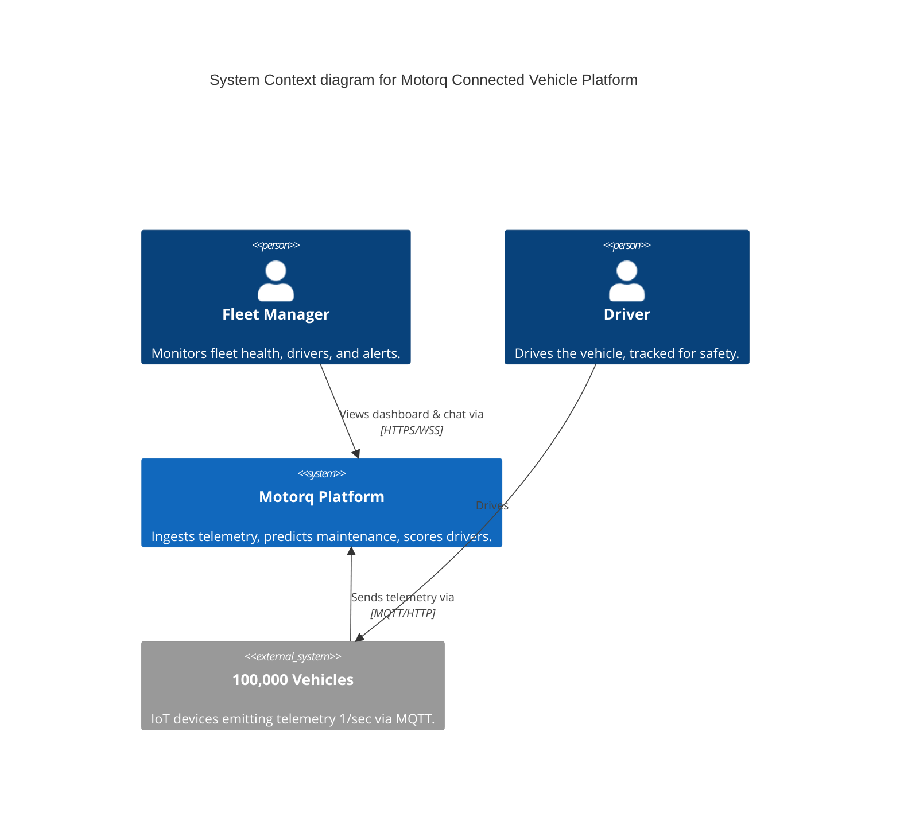
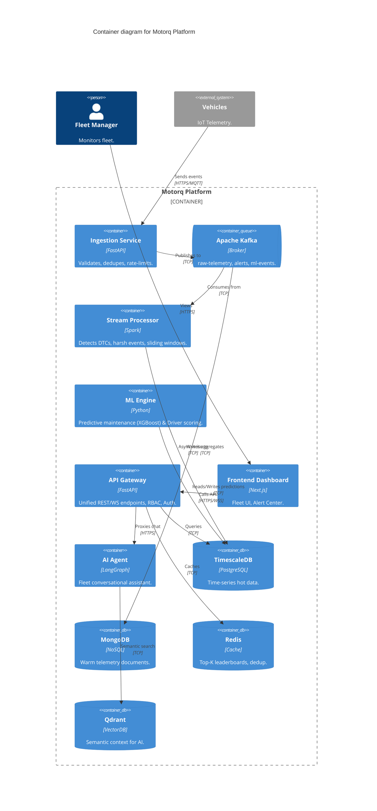

# C4 Architecture Model - Motorq Platform

## Level 1: System Context

```mermaid
C4Context
    title System Context diagram for Motorq Connected Vehicle Platform

    Person(fleet_manager, "Fleet Manager", "Monitors fleet health, drivers, and alerts.")
    Person(driver, "Driver", "Drives the vehicle, tracked for safety.")
    
    System(motorq_platform, "Motorq Platform", "Ingests telemetry, predicts maintenance, scores drivers.")
    
    System_Ext(vehicles, "100,000 Vehicles", "IoT devices emitting telemetry 1/sec via MQTT.")
    
    Rel(fleet_manager, motorq_platform, "Views dashboard & chat via", "HTTPS/WSS")
    Rel(driver, vehicles, "Drives")
    Rel(vehicles, motorq_platform, "Sends telemetry via", "MQTT/HTTP")
```

## Level 2: Container Diagram

```mermaid
C4Container
    title Container diagram for Motorq Platform

    Person(fleet_manager, "Fleet Manager", "Monitors fleet.")
    System_Ext(vehicles, "Vehicles", "IoT Telemetry.")

    Container_Boundary(motorq, "Motorq Platform") {
        Container(ingestion, "Ingestion Service", "FastAPI", "Validates, dedupes, rate-limits.")
        ContainerQueue(kafka, "Apache Kafka", "Broker", "raw-telemetry, alerts, ml-events.")
        Container(stream_proc, "Stream Processor", "Spark", "Detects DTCs, harsh events, sliding windows.")
        Container(ml_engine, "ML Engine", "Python", "Predictive maintenance (XGBoost) & Driver scoring.")
        Container(api_gw, "API Gateway", "FastAPI", "Unified REST/WS endpoints, RBAC, Auth.")
        Container(frontend, "Frontend Dashboard", "Next.js", "Fleet UI, Alert Center.")
        Container(agent, "AI Agent", "LangGraph", "Fleet conversational assistant.")
        
        ContainerDb(timescale, "TimescaleDB", "PostgreSQL", "Time-series hot data.")
        ContainerDb(mongo, "MongoDB", "NoSQL", "Warm telemetry documents.")
        ContainerDb(redis, "Redis", "Cache", "Top-K leaderboards, dedup.")
        ContainerDb(qdrant, "Qdrant", "VectorDB", "Semantic context for AI.")
    }

    Rel(vehicles, ingestion, "Sends events", "HTTPS/MQTT")
    Rel(ingestion, kafka, "Publishes to", "TCP")
    Rel(kafka, stream_proc, "Consumes from", "TCP")
    Rel(kafka, mongo, "Async write to", "TCP")
    
    Rel(stream_proc, timescale, "Writes aggregates", "TCP")
    Rel(ml_engine, timescale, "Reads/Writes predictions", "TCP")
    
    Rel(fleet_manager, frontend, "Views", "HTTPS")
    Rel(frontend, api_gw, "Calls API", "HTTPS/WSS")
    Rel(api_gw, timescale, "Queries", "TCP")
    Rel(api_gw, redis, "Caches", "TCP")
    Rel(api_gw, agent, "Proxies chat", "HTTPS")
    Rel(agent, qdrant, "Semantic search", "TCP")
```
