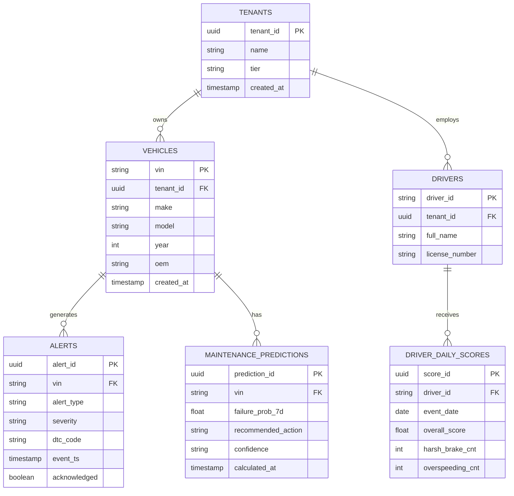

# Entity-Relationship (ER) Diagram - Motorq Database

```mermaid
erDiagram
    TENANTS {
        uuid tenant_id PK
        string name
        string tier
        timestamp created_at
    }

    VEHICLES {
        string vin PK
        uuid tenant_id FK
        string make
        string model
        int year
        string oem
        timestamp created_at
    }

    DRIVERS {
        string driver_id PK
        uuid tenant_id FK
        string full_name
        string license_number
    }

    ALERTS {
        uuid alert_id PK
        string vin FK
        string alert_type
        string severity
        string dtc_code
        timestamp event_ts
        boolean acknowledged
    }

    DRIVER_DAILY_SCORES {
        uuid score_id PK
        string driver_id FK
        date event_date
        float overall_score
        int harsh_brake_cnt
        int overspeeding_cnt
    }

    MAINTENANCE_PREDICTIONS {
        uuid prediction_id PK
        string vin FK
        float failure_prob_7d
        string recommended_action
        string confidence
        timestamp calculated_at
    }

    TENANTS ||--o{ VEHICLES : "owns"
    TENANTS ||--o{ DRIVERS : "employs"
    VEHICLES ||--o{ ALERTS : "generates"
    VEHICLES ||--o{ MAINTENANCE_PREDICTIONS : "has"
    DRIVERS ||--o{ DRIVER_DAILY_SCORES : "receives"
```
